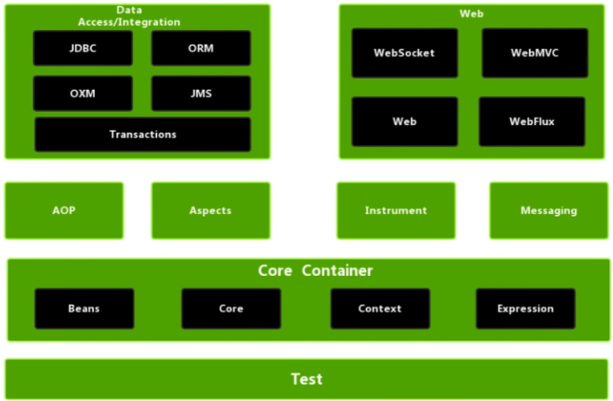
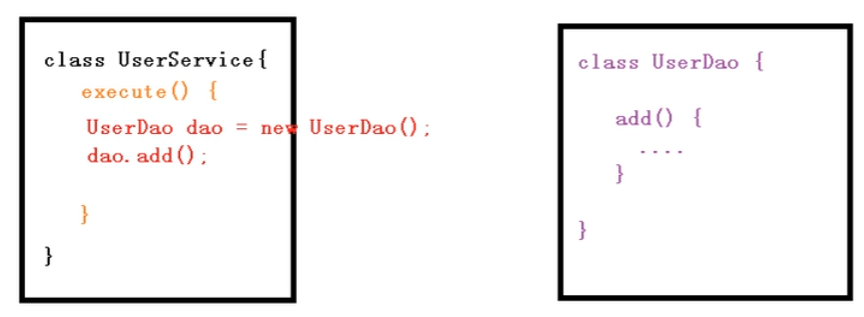
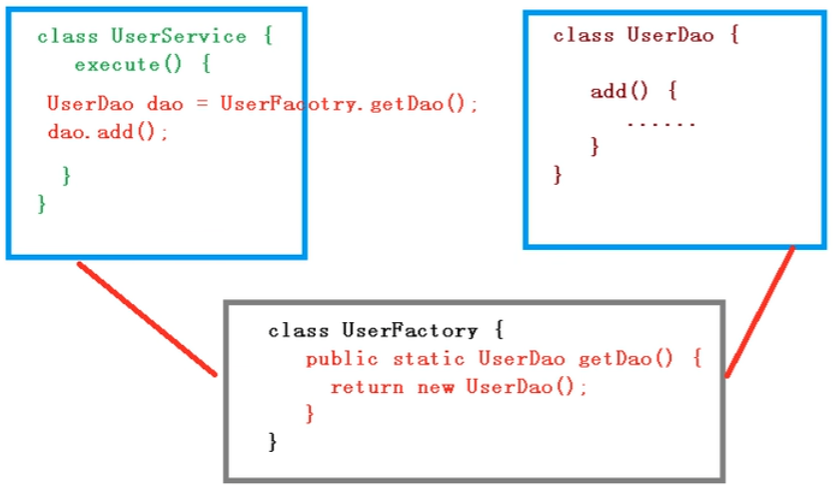
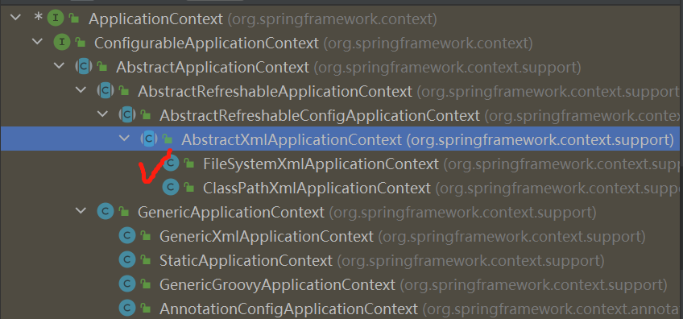

# Spring概念

## 1.基本概念

1. Spring是**轻量级（体积小、引用的jar包少、可以独立运行使用）**的开源的 JaveEE **框架（让开发更方便、简洁，目的是解决企业应用开发的复杂性），高效整合其它特性**
2. Spring两个核心部分：**IOC、AOP**
   - IOC：控制反转，将创建对象的过程交给Spring进行管理，简单说就是不需要自己去new对象
   - AOP：面向切面，在不修改源代码的前提下进行功能的添加
3. Spring框架优势
   - 方便解耦，简化开发
   - 支持AOP编程
   - 方便程序测试
   - ……

## 2.入门案例

### 1).创建项目

在IDEA中创建一个正常的java项目即可

### 2).导入Spring相关jar包



​																										  **Spring模块图**

上图为Spring模块图，**Beans和Core对应的IOC，Context为上下文，Expression为表达式，这四个包是核心，必需的。**因此在下载的Spring5/libs文件夹中，找到对应的四个jar包，导入到项目中

除此之外还要下载并导入commons-logging.jar包，日志，不然会报错

### 3).创建一个普通类

```java
public class User {
    public void add(){
        System.out.println("add..........");
    }
}
```

### 4).用Spring实例化（配置文件or注解）

这里用配置文件实现，创建Spring**配置文件（xml格式）**，在配置文件使用**bean标签**配置创建的对象：

```java
    <!--配置ueser类-->
    <bean id="user" class="com.atguigu.spring5.User"></bean>
```

### 5).编写测试代码

下载单元测试相关的两个包，导入到项目中，然后**1.加载配置文件2.获取配置文件创建的对象**即可

```java
package TestDemo;

import com.atguigu.spring5.User;
import org.springframework.context.ApplicationContext;
import org.springframework.context.annotation.EnableLoadTimeWeaving;
import org.junit.Test;
import org.springframework.context.support.ClassPathXmlApplicationContext;

public class TestSpring5 {

    @Test
    public void testAdd(){
        //1.加载配置文件，bean.xml
        ApplicationContext context=
                new ClassPathXmlApplicationContext("bean.xml");
        //2.获取配置文件创建的对象
        User user=context.getBean("user1", User.class);

        //测试
        System.out.println(user);
        user.add();
    }
}
```

# IOC容器

## 1.IOC底层原理

IOC就是控制反转，**把对象的创建和对象之间的引用过程都交给Spring来管理**，使得代码耦合度降低，上述入门案例就是IOC的一个实现

1. IOC底层原理：核心技术是**XML解析、工厂模式、反射**

2. 举例：原始对象间调用，需要在一个类中实现另一个类，如图，从Service中掉用Dao

   

   显而易见这种方式代码间耦合度太高，解决方案中**有一种是工厂模式**：

   

   如上图，通过设置一个工厂类来降低Service类与UserDao类之间的耦合度，但是工厂类与对象之间仍然有耦合度**（当然调用关系之间耦合度不可能没有）**

   进一步降低耦合度则需要用到IOC原理**（XML解析、工厂模式、反射）：**

   - xml配置文件中**配置需要创建的对象**

     ```java
     <bean id="dao" class="com.atguigu.UserDao"></bean>
     ```

   - 比如有Service和Dao两个类，需要在前者中调用后者，则**创建工厂类，利用XML解析和反射的方法实现**

     ```java
     Class UserFactory{
     	public static UserDao getDao(){
     		String classValue = class属性值;//1.xml解析，得到com.atguigu.UserDao
             //2.通过反射创建对象
             Class clazz = Class.forName(classValue);//直接得到编码文件，.class文件
             return (UserDao)clazz.newInstance();
     	}
     }
     ```

## 2.IOC接口（BeanFactory）

1. IOC思想基于IOC容器完成，IOC容器底层就是对象工厂

2. Spring提供了IOC容器的两种实现方式，**即两个接口，他们都能实现加载配置文件，然后创建对象**

   - BeanFactory：**这是IOC容器基本实现，是Spring内部使用的接口，一般不提供给开发人员进行使用**

     ```java
     BeanFactory context=
                     new ClassPathXmlApplicationContext("bean.xml");
     ```

     特点就是在上述代码中只会加载配置文件，不会创建里边的对象，而是在获取、使用的时候创建对象

   - ApplicationContext：**BeanFactory的子接口，提供更多，更强大的功能，一般面向开发人员**

     ```java
     ApplicationContext context=
                     new ClassPathXmlApplicationContext("bean.xml");
     ```

     它的特点是在加载配置文件的时候，就会创建其中的对象

     **一般来说，将这种耗时、耗资源的行动，都放在项目启动时比较好，因此第二种比较好**

3. ApplicationContext接口有实现类

   

   主要的就是FileSystemXmlApplicationContext和ClassPathXmlApplicationContext这两个实现类

   - FileSystemXmlApplicationContext：带盘全路径

     ```java
     ApplicationContext context=
                     new ClassPathXmlApplicationContext("D://...//bean.xml");
     ```

   - ClassPathXmlApplicationContext：类路径，即bean.xml

     ```java
     ApplicationContext context=
                     new ClassPathXmlApplicationContext("bean.xml");
     ```

## 3.IOC操作Bean管理（基于XML）


## 4.IOC操作Bean管理（基于注解）


# AOP

​    


# JDBCTemplate


# 事务管理


# Spring5新特性